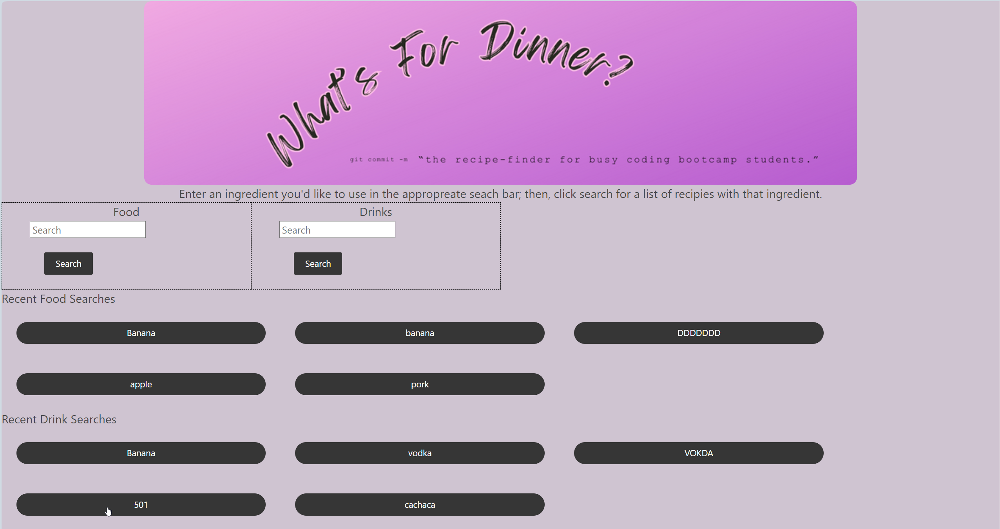
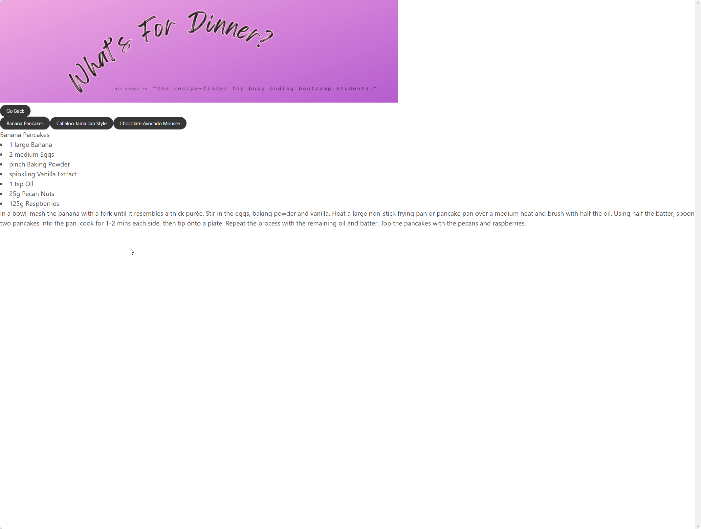
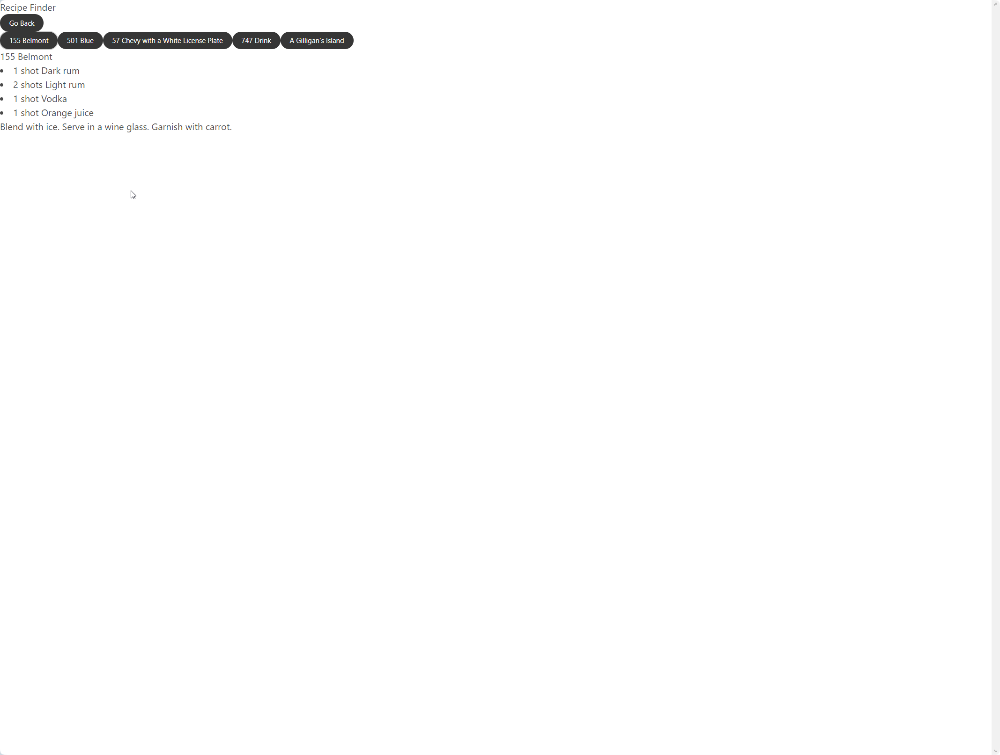

# What’s For Dinner: 
The meal-planner for busy coding bootcamp students
## User Story
As a busy bootcamp student with limited time to plan my meals, I need quick and easy way to look up food recipies.
## Description:
What’s For Dinner is a web app that helps busy coding bootcamp students (among others) search for recipes featuring a user-provided ingredient.
## Credits
Liz Fischenich - https://github.com/lizfischstix
Ingrid Miranda - https://github.com/ingridmidia
Jackson Neuman - https://github.com/jneums81
Chris Kirkley - https://github.com/Peaky00
## Live Link
https://lizfischstix.github.io/mealplannerapp/
## Screenshot

## Files/Links/CDN Required
./assets/js/script.js
./assets/css/reset.css
./assets/css/style.css  
https://cdn.jsdelivr.net/npm/bulma@0.9.4/css/bulma.min.css
## Instructions
When first joining the web application start by getting access to the api at https://cors-anywhere.herokuapp.com. You can also request access through the developer tools in console. After that task is completed you can use the web application to enter in a ingredient in the search bar for a foor or a drink ingredient in the drink section to search your favorite recipes! Click on recipes after be redirected and start your meal planning!